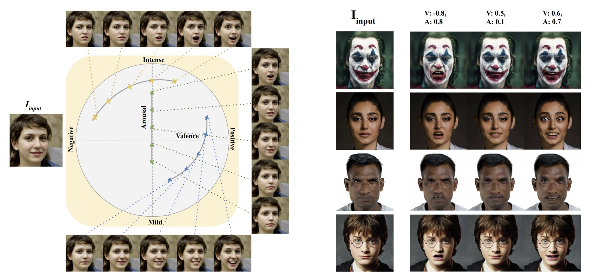
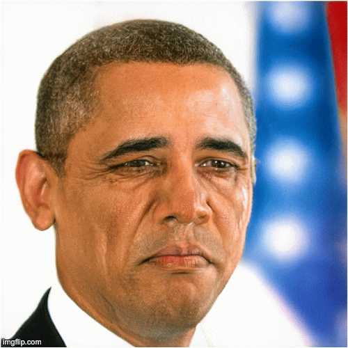
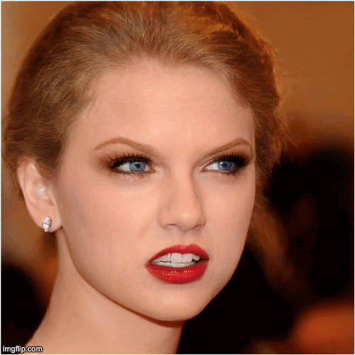

<div align="center">


# 🙂😐🙁 EmoStyle: One-Shot Facial Expression Editing Using Continuous Emotion Parameters


[](https://opensource.org/licenses/MIT)

<div>
    <a target='_blank'>Bita Azari</a>&emsp;
    <a href='https://www.sfu.ca/computing/people/faculty/angelicalim.html' target='_blank'>Angelica Lim</a>&emsp;
</div>
<br>
<div>
    Simon Fraser University &emsp;
</div>
<br>
<i><strong><a href='https://openaccess.thecvf.com/content/WACV2024/papers/Azari_EmoStyle_One-Shot_Facial_Expression_Editing_Using_Continuous_Emotion_Parameters_WACV_2024_paper.pdf' target='_blank'>WACV 2024</a></strong></i>
<br>
<br>
<!-- <br>
  <p align="center">
    
  </p>
<br> -->
</div>


>** EmoStyle: One-Shot Facial Expression Editing Using Continuous Emotion Parameters**<br>
> Bita Azari, Angelica Lim <br>
>
>**Abstract:** Recent studies have achieved impressive results in face generation and editing of facial expressions. However, existing approaches either generate a discrete number of facial expressions or have limited control over the emotion of the output image. To overcome this limitation, we introduced EmoStyle, a method to edit facial expressions based on valence and arousal, two continuous emotional parameters that can specify a broad range of emotions. EmoStyle is designed to separate emotions from other facial characteristics and to edit the face to display a desired emotion. We employ the pre-trained generator from StyleGAN2, taking advantage of its rich latent space. We also proposed an adapted inversion method to be able to apply our system on out-of-StyleGAN2 domain (OOD) images in a one-shot manner. The qualitative and quantitative evaluations show that our approach has the capability to synthesize a wide range of expressions to output high-resolution images.


## Getting started

### Setup environment

In order to run any Python script from this repository, you will need to setup their execution environment.

You will need Nvidia CUDA toolkit `nvcc`.
```sh
sudo apt install nvidia-cuda-toolkit
```

You also need the gcc version matching your CUDA version (e.g. CUDA 11.2 supports g++-10 max).
```sh
nvcc --version
```
Once you have your CUDA version, refer to this [StakOverflow question](https://stackoverflow.com/questions/6622454/cuda-incompatible-with-my-gcc-version) for more information about the supported gcc version and install it.
```sh
sudo apt install g++-10
```

Install Pytorch with pip inside a virtual environment.
```sh
python3 -m venv .venv
.venv/bin/pip3 install torch torchvision torchaudio
```

Install other dependencies
```sh
.venv/bin/pip3 install requests tqdm Ninja matplotlib lpips scikit-image
```

Activate virtual environment in your shell before running any Python script.
```sh
source .venv/bin/activate
```

### Download pretrained weights

Please download pretrained weights so you do not have to train them yourself.
Create a directory `pretrained` and the following weights in it:
- **EmoMapping wplus** ([emo_mapping_wplus_2.pt](https://drive.google.com/file/d/17C1-ACpPbFnaRNVYpDPrzNTYbFJPL_7h/view?usp=sharing)), the weights of this project's model, trained on generated images from StyleGAN2
- **8-emotion Emonet** ([emonet_8.pth](https://github.com/face-analysis/emonet/blob/master/pretrained/emonet_8.pth)), 
- **Resnet** ([resnet50_ft_weight.pkl](https://drive.google.com/file/d/1A94PAAnwk6L7hXdBXLFosB_s0SzEhAFU/view)), 
- **FFHQ StyleGAN2** ([ffhq.pkl](https://nvlabs-fi-cdn.nvidia.com/stylegan2-ada-pytorch/pretrained/ffhq2.pkl)), StyleGANv2 model trained on FFHQ
- **dlib landmarks model** ([shape_predictor_68_face_landmarks.dat.bz2](http://dlib.net/files/shape_predictor_68_face_landmarks.dat.bz2)), used in background loss and pose loss + preprocessing images
- | **IR-SE50 Model** ([model_ir_se50.pth](https://drive.google.com/file/d/1KW7bjndL3QG3sxBbZxreGHigcCCpsDgn/view?usp=sharing)) | Pretrained IR-SE50 model taken from [TreB1eN](https://github.com/TreB1eN/InsightFace_Pytorch) in Used ID loss
  

### Generate new images

Run `generate_dataset_pkl.py` script. Specify if you want to use the CPU instead of CUDA cores on GPU.
This will generate 1000 original images in `dataset/1024_pkl` directory using model StyleGAN2. 
```sh
python generate_dataset_pkl.py --samples 24 --cpu
```

### Changing emotions on images

Now run `test.py` to edit face images from `dataset/1024_pkl`.
You can specify if you want to use the CPU instead of CUDA cores on GPU.
```sh
python test.py --test_mode folder_images --valence 0 -0.5 0.2 --arousal 0 -0.5 0.2 --wplus --cpu
```


## Detailed usage
#### Dataset
Use `generate_dataset_pkl.py` to generate images from [StyleGAN2](https://github.com/NVlabs/stylegan2?tab=readme-ov-file) domain. Following the recommendation in the original StyleGAN paper, we truncated the vectors by a factor of 0.7.

#### Train EmoMapping
To train your model, use the `train_emostyle.py` script with the following command-line arguments:

```bash
python train_emostyle.py \
    --datapath "dataset/1024_pkl/" \
    --stylegan2_checkpoint_path "pretrained/ffhq.pkl" \
    --vggface2_checkpoint_path "pretrained/resnet50_ft_weight.pkl" \
    --emonet_checkpoint_path "pretrained/emonet_8.pth" \
    --log_path "logs/" \
    --output_path "checkpoints/" \
    --wplus \
    --cpu
```
- `datapath`: Path to the dataset. This should be the directory containing your dataset files.
- `stylegan2_checkpoint_path`: Path to the StyleGAN2 checkpoint. Provide the location of the pre-trained StyleGAN2 checkpoint file.
- `vggface2_checkpoint_path`: Path to the VGGFace2 checkpoint. Specify the path to the pre-trained VGGFace2 checkpoint file.
- `emonet_checkpoint_path`: Path to the Emonet checkpoint. Set the path to the pre-trained Emonet checkpoint file.
- `log_path`: Path to the log directory. Choose the directory where log files will be stored during the training process.
- `output_path`: Path to the output directory. Define the directory where trained model checkpoints will be saved.
- `wplus`: Enable wplus. Include this flag if you want to enable the wplus option during training.
- `cpu`: Use CPU. Include this flag if you want to run models on the CPU instead of CUDA cores on GPU.

### Personalized Track
#### Dataset
Using 1 or more images of a person cropped the faces in to StyleGAN desired input format, invert the image using [PTI](https://github.com/danielroich/PTI) inversion`pti_invert.py`.

#### Finetune StyleGAN
 To train your personalized model, use the `personalized.py` script.

```bash
python personalized.py \
    --datapath "experiments/personalized_single_4/" \
    --stylegan2_checkpoint_path "pretrained/ffhq.pkl" \
    --emo_mapping_checkpoint_path "checkpoints/emo_mapping_wplus/emo_mapping_wplus_2.pt" \
    --vggface2_checkpoint_path "pretrained/resnet50_ft_weight.pkl" \
    --emonet_checkpoint_path "pretrained/emonet_8.pth" \
    --log_path "logs/personalized" \
    --inversion_type 'e4e' \
    --output_path "checkpoints/" \
    --wplus True
  ```
- `datapath`: Path to the folder of the specific person in the dataset. This directory should contain the relevant data for the personalized training.
- `stylegan2_checkpoint_path`: Path to the StyleGAN2 checkpoint. Provide the location of the pre-trained StyleGAN2 checkpoint file.
- `emo_mapping_checkpoint_path`: Path to the checkpoint for the emotion mapping. Specify the path to the pre-trained emotion mapping checkpoint file.
- `vggface2_checkpoint_path`: Path to the VGGFace2 checkpoint. Specify the path to the pre-trained VGGFace2 checkpoint file.
- `emonet_checkpoint_path`: Path to the Emonet checkpoint. Set the path to the pre-trained Emonet checkpoint file.
- `log_path`: Path to the log directory. Choose the directory where log files will be stored during the personalized training process.
- `inversion_type`: Type of inversion, either 'e4e' or 'w_encoder'.
- `output_path`: Path to the output directory. Define the directory where trained model checkpoints will be saved.
- `wplus`: Enable wplus. Include this flag if you want to enable the wplus option during training.

### Test

To run the `test.py` script, use the following command with the desired parameters:

```bash
python test.py \
    --images_path your_images_path \
    --stylegan2_checkpoint_path your_checkpoint_path \
    --checkpoint_path your_mapping_path \
    --output_path your_output_path \
    --test_mode your_test_mode \
    --valence 0 -0.5 0.2 \
    --arousal 0 -0.5 0.2 \
    --wplus \
    --cpu
```

- `images_path`: Path to the directory containing images for testing.
- `stylegan2_checkpoint_path`: Path to the StyleGAN2 checkpoint file.
- `checkpoint_path`: Path to the checkpoint file for emo_mapping.
- `output_path`: Path to the directory where results will be saved.
- `test_mode`: Test mode, can be 'random' or 'folder_images'.
- `valence`: List of valence values (space-separated), e.g., 0 -0.5 0.2.
- `arousal`: List of arousal values (space-separated), e.g., 0 -0.5 0.2.
- `wplus`: Use W+ instead of W.
- `cpu`: Use CPU. Include this flag if you want to run models on the CPU instead of CUDA cores on GPU.

<div align="center">

<br>
  <p align="center">
    
    <!--  -->
  </p>
<br>

</div>

## Citation

If you use this code for your research, please cite our paper:

```
@inproceedings{azari2024emostyle,
      title     = {EmoStyle: One-Shot Facial Expression Editing Using Continuous Emotion Parameters},
      author    = {Azari, Bita and Lim, Angelica},
      booktitle = {Proceedings of the IEEE/CVF Winter Conference on Applications of Computer Vision},
      pages     = {6385--6394},
      year      = {2024}
}
```
